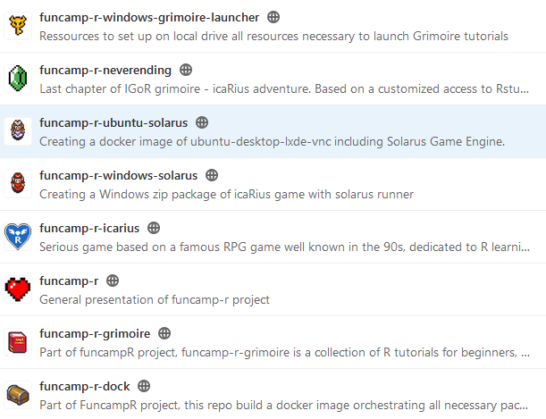

# Espace pour les contributeurs au développement

A l'image des deux environnements qu'il propose aux joueurs/stagiaires avec le jeu icaRius d'une part et le grimoire IGoR d'autre part, le projet Funcamp-R comporte deux volets pour lesquels il est possible de contribuer :

- le code source du jeu icaRius, développé avec le moteur Solarus
- le code source des tutoriels R, regroupés sous la forme d'un package.

Pour porter ces environnements en mode Cloud, chaque volet est par ailleurs orchestré par un système de containers docker : 

- le jeu icaRius est empaquetté dans une image virtuelle d'un Ubuntu dans lequel le moteur de jeu Solarus a été pré-installé, puis est proposé en accès web via une interface Vnc
- le grimoire IGoR est empaquetté dans une image virtuelle d'un serveur R-Shiny, enrichi de l'ensemble des dépendances nécessaires pour faire fonctionner les tutoriels, en particulier les packages Learnr et Parsons.

Enfin, le [site documentaire](http://funcamp-r.pages.lab.sspcloud.fr/funcamp-r) que vous consultez actuellement est réalisé avec mkdocs et publié sous forme de pages Gitlab. 

Toutes les ressources sont structurées sous forme de dépôts dans le Gitlab proposé par la plateforme SSPCloud, à l'adresse [https://git.lab.sspcloud.fr](https://git.lab.sspcloud.fr). Y figurent les dépôts suivants :

- funcamp-r : site documentaire présentant le projet. 
- funcamp-r-grimoire : le code-source pour le package R correspondant au grimoire avec l'ensemble des tutoriels. Ce package a été réalisé avec l'appui précieux et apprécié (au moins 50 rubis à la mode icarius) de la société ThinkR.
- funcamp-r-dock : système d'orchestration docker du package pour proposer de suivre en ligne les tutoriels. Ce dispositif a été réalisé avec l'expertise magique de la société ThinkR et de la division Innovation et instruction technique de l'Insee.
- funcamp-r-neverending : dernier chapitre du grimoire, correspondant à un environnement R-studio avec un projet associé, avec édition simplifié de Rmd (utilisation de xaringan). Ecrit avec la plume de la société ThinkR.
- funcamp-r-icarius : le code source du jeu, correspondant à une "quête" développée dans le moteur de jeu Solarus. 
- funcamp-r-ubuntu-solarus : système d'orchestration docker du jeu pour proposer une expérience en mode Cloud. Ce dispositif a été réalisé avec l'aide inextinguible (> 10 coeurs) de la division Innovation et instruction technique de l'Insee.
- funcamp-r-windows-solarus : mise à disposition du runner Solarus et de la quête icaRius, pour l'environnement Windows. Téléchargeable et installable en mode portable sur une clé USB
- funcamp-r-windows-grimoire-launcher : dispositif d'empaquettage de l'ensemble des ressources - vidéoludiques et pédagogiques - pour suivre le funcamp en mode portable,  en installant ces ressources sur une clé USB pour un poste windows. Un frontend est inclus pour permettre au stagiaire de lancer facilement chaque étape du funcamp.

Vous souhaitez contribuer ? Proposer une amélioration ou correction sous forme d'issue ? Rendez-vous sur l'un des espaces concernés : 

