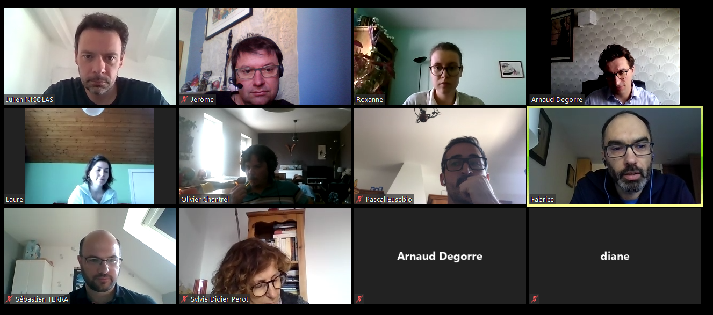

# Les acteurs du projet

## Qui sommes-nous ?

Un groupe de joyeux lurons, assurément ! Mais aussi, à l'occasion, des statisticiens, géomaticiens, économistes et autres "datascientists" intéressés par les questions de pédagogie...

- Insee, DSI, Unissi : Arnaud Degorre, arnaud.degorre@insee.fr
- Insee, DSI, projet Palettes : Jean-Luc Lipatz, jean-luc.lipatz@insee.fr
- MTES, Sylvie Didier-Perot, sylvie.didier-perot@developpement-durable.gouv.fr
- MTES, DREAL Pays-de-la-Loire, Maël Theulière, mael.theuliere@developpement-durable.gouv.fr
- MTES, Jérôme Baret , jerome.baret@developpement-durable.gouv.fr
- MTES, Olivier Chantrel, olivier.chantrel@developpement-durable.gouv.fr
- Insee, CEFIL, Julien Nicolas, julien.nicolas@insee.fr
- Insee, DR Nouvelle Aquitaine, Laure Genebes, laure.genebes@insee.fr
- Insee, DR PACA,  Pascal Eusébio, pascal.eusebio@insee.fr
- Insee, DR Centre Val de Loire, Sébastien Terra, sebastien.terra@insee.fr
- Insee, DR Hauts de France, Fabrice Danielou, fabrice.danielou@insee.fr
- ThinkR - Diane Beldame, diane@thinkr.fr
- ThinkR - Vincent Guyader, vincent@thinkr.fr

Un aperçu d'une partie de l'équipe, à l'occasion d'une Webconf pendant la période de confinement :

## Remerciements

Nous remercions l'ensemble des acteurs qui nous ont fait confiance dans la réalisation de ce projet, et qui nous ont épaulé dans cette aventure.

Au sein de **l'Insee**, la démarche a été pilotée par la Direction du système d'information au sein de l'Unité Innovation et stratégie du SI. Elle a été suivie et soutenue par un groupe d'acteurs associant le directeur du projet Insee 2025, les acteurs de formation continue (le CEFIL, Centre de formation de l'Insee à Libourne, et la division Formation) et des directions régionales (Nouvelle-Aquitaine, Provence Alpes Côte d'Azur, Haut-de-France, Centre Val de Loire). Le projet a d'emblée profité de la participation du **ministère de la Transition écologique et solidaire**, avec le Commissariat général au développement durable (CGDD) et le Service de la donnée et des études statistiques (SDES).

La **société ThinkR**, spécialisée dans la formation R en France, nous a accompagnés tout au long du périple d'icaRius. Développeurs et consultants expérimentés, passionnés et contributeurs open source, les formateurs thinkR ont apporté à la fois leur sensibilité pédagogique et leur expertise technique. Les contenus de leurs formations font la part belle à la pratique, dans un état d'esprit « learning by doing » que l'on retrouve également dans la philosophie du funcamp R. En particulier, thinkR promeut une approche dite « cake first », qui consiste à outiller aussi rapidement et efficacement que possible les stagiaires en s’affranchissant de détails techniques ou superflus - ce que nous avons également retenu pour construire les chapitres du grimoire IGoR. 

Pour en savoir plus sur thinkR : [https://thinkr.fr/](https://thinkr.fr/)

Nous remercions également la **communauté Solarus** pour son accueil et son aide. Grâce à la richesse des ressources proposées en ligne, avec des packs de ressources, des tutoriels vidéos, un forum très actif, l'appropriation des bases du moteur de jeu "from scratch" a pu se faire dans le calendrier du projet. Merci en particulier à christopho, l'auteur du moteur Solarus, et Diarandor, pour leurs premiers conseils. A l'issue de ce premier prototype de funcamp, un travail partenarial pourra être proposé à la communauté Solarus, désormais structurée sous forme d'association, pour améliorer le code du jeu et en proposer une version complètement open source.

Pour en savoir plus sur Solarus : [https://www.solarus-games.org/](https://www.solarus-games.org/)

