# Espace pédagogique - trame de formation

**Attention spoiler** : la trame pédagogique est présentée de concert avec l'habillage narratif :-)

**Pour la solution des énigmes du grimoire** : pour les tricheurs ou les joueurs pressés, ces dernières sont consultables directement sur les premières lignes du fichier [strings.dat](https://git.lab.sspcloud.fr/funcamp-r/funcamp-r-icarius/-/blob/master/data/languages/fr/text/strings.dat). Par exemple, pour le tutoriel XX, il s'agit de la valeur "la_solution" indiquée dans le paramètre `value = ` qui figure dans la ligne `text{ key = "igor_answers.chapterXX_answer1", value = "la_solution" }`

## Enigme 1 – la maison d’icaRius

**objectifs pédagogiques**
- Présenter R (open source, multi-plateforme) et ses possibilités (graphiques, calculatoires, web, SIG...)
- Présenter la programmation avec R comme un dialogue avec la console ; décrire la boîte de dialogue 
-Faire des opérations arithmétiques et manipuler un objet

**cadre narratif**
Début de l’aventure dans la maison d'icaRius. Découverture du grimoire IgoR et de la langue des Runes

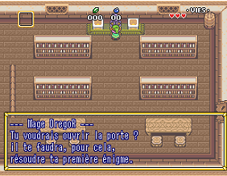

*(l’aventure continue…)*
Exploration des plaines de Statis.
Rencontre de Statia, qui offre à icaRius son épée et lui demande de retrouver les 6 Runes.
Entrée dans le village de Kokoro

## Enigme 2 – la poule pondeuse

**objectifs pédagogiques**
- Savoir importer un fichier sous différent format
- Appréhender la notion de chemin vers une ressource et un répertoire
- Afficher des données et en avoir une première exploration (nombre de lignes, de colonnes, premiers enregistrements)

**cadre narratif**
Dans le village de Kokoro, icaRius aide la fermière et le fermier à recomposer le livre des pontes pour trouver la meilleure poule pondeuse
En récompose, le mage Tourep lui offre un bouclier

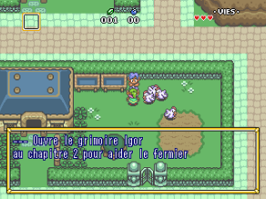

*(l’aventure continue…)*
Le soldat laisse passer icaRius et sortir du village Kokoro
1er boss (le papillon géant) et obtention d’une première Rune.
Entrée dans le village de GrissGrass

## Enigme 3 – le village de GrissGrass

**objectifs pédagogiques**
Apprendre à utiliser une fonction parmi celles chargées dans l’environnement R
Comprendre la notion d’argument dans une fonction
Utiliser une fonction de statistique descriptive sur un jeu de données
Lire des indicateurs de distribution (moyenne, médiane...)

**cadre narratif**
Le chef du village de GrissGrass demande à icaRius de trouver quelle est l’exploitation la plus productive en herbe de Mandragore.

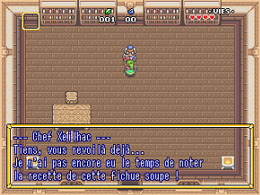

*(l’aventure continue…)*
Le chef du village demande à icaRius de percer le mystère de l’exploitation du fermier Galia

## Enigme 4 – le secret de la culture de Mandragore

**objectifs pédagogiques**
Introduction du ` %>% `
notion de grammaire avec `verbe(sujet, complément)` devient `sujet %>% verbe(complément)`

**cadre narratif**
Le fermier Galia aide icaRius à retrouver la recette de la culture de la Mandragore

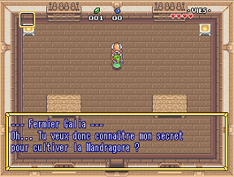

*(l’aventure continue…)*
Le chef du village offre à icaRius un jus de Mandragore. Ce dernier lui permet de franchir le cimetière du village. 2ème boss du jeu (l’homme enterré) et d’obtenir la 2ème Rune.
IcaRius rejoint le château de Statis. Il rencontre le chef de armées (qui est un sbire du sorcier SaSSoS)

## Enigme 5 – le château de Statis et le cuistot Batreb

**objectifs pédagogiques**
comprendre les notions de couches graphiques
Maîtrise les fonctions associées à ggformula
tracer un nuage de point, une courbe, un diagramme en barre

**cadre narratif**
Se faisant passer pour un soldat de l’armée de SaSSoS, icaRius fait croire au chef des armées qu’il va attraper le traitre Essespéus. Pour libérer ce dernier, il doit d’abord obtenir la confiance du cuistot Batreb

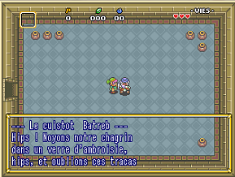

*(l’aventure continue…)*
Batreb donne la clef à icaRius, qui retrouve Essespéus  dans une partie secrète du château (la cave à Ambroisie)

## Enigme 6 – Essespéus et la fake news

**objectifs pédagogiques**
Appréhender la personnalisation des couches graphiques (couleurs, formes)
Maîtriser les éléments connexes d’un graphique (titre, légende...)

**cadre narratif**
Essespéus et icaRius vont créer une Fake News pour tromper les armées de SaSSoS. Pour cela, ils doivent identifier quel est le royaume le mieux armé et le plus éloigné, en faisant ensuite croire qu’il s’agit au contraire du territoire le plus faible et le plus proche, afin d’y diriger les troupes ennemies pour gagner du temps. 

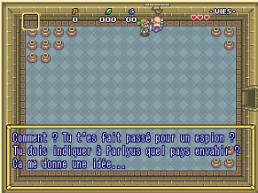

*(l’aventure continue…)*
Le chef des armées prend pour argent comptant la fake news. Il quitte le château pour attaquer ce territoire prétendument proche, et laisse icaRius accèder à la salle de commandement, où se trouve le sorcier SaSSoS. Au cours du combat entre icaRius et SaSSoS, la princesse Statia vient aider le héros… qui triomphe. Il obtenient la 3ème Rune. Mais ce n’était qu’un simulacre de SaSSoS, une projection du sorcier qui défie icaRius de venir le vaincre en personne.

## Enigme 7 – le labyrinthe (optionnel)

**objectifs pédagogiques**
comprendre la notion de vecteur
Manipuler des vecteurs et des éléments de vecteur
Utiliser la position des éléments dans des calculs

**cadre narratif**
Une fois sortie du château, icaRius rencontre le Mage Delagarde. Ce dernier lui propose un défi (optionnel) pour obtenir les bonnes directions lui permettant de gagner du temps dans le labyrinthe. A noter côté jeu : une épreuve optionnelle pour débloquer un mode « pacman ». 

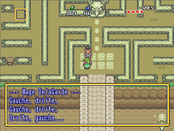

*(l’aventure continue…)*
IcaRius franchit le labyrinthe, puis se trouve devant un passage bloqué par une pierre qu’il lui faut soulever. Le mage Zilap vient l’aider

## Enigme 8 – la plume d’IgoR

**objectifs pédagogiques**
Découvrir la notion de package
Prendre connaissance de l’ensemble de packages liées au Tidyverse

**cadre narratif**
Pour soulever la pierre qui bloque le passage, icaRius doit apprendre de nouveau sortilège. Le mage Zilap lui explique comment ajouter des chapitres à son grimoire IgoR (chaque package étant un nouveau chapitre).

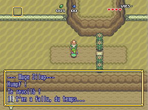

*(l’aventure continue…)*
Zilap offre à icaRius la plume du tidyverse. Cette dernière a le pouvoir de rendre léger les obstacles qui semblaient insurmontables : icaRius peut désormais soulever des pierres sur son passage

## Enigme 9 – le village de Sandia

**objectifs pédagogiques**
Découvrir des fonctions de dplyr pour manipuler les données
Utiliser filter(), arrange(), mutate()
Composer des fonctions sur un jeu de données

**cadre narratif**
IcaRius arrive dans le village de Sandia. Mam’Grouxi lui narre les innombrables naissances qu’elle a vu au fil des ans (des siècles?). Elle lui demande de retrouver, dans le registre des naissances, le nom d’une jeune fille dont le Mana (la force vitale et magique) est le plus élevé.

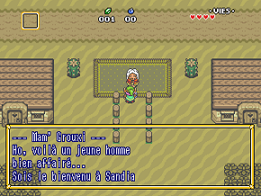

*(l’aventure continue…)*
IcaRius trouve le nom de la mystérieuse jeune fille (qui se trouve être la princesse Statia). Mam’Grouxi lui offre des bombes en cadeau. Ces dernières lui permettent de découvrir un passage secret dans la paroi d’une falaise. IcaRius explore des grottes, jusqu’à vaindre un nouveau boss et obtenir la 4ème Rune.

## Enigme 10 – la porte de sortie, « Save Me »

**objectifs pédagogiques**
(i) sauvegarder les objets dans l'environnement R, avec save()
(ii) exporter les résultats en dehors de l'environnement R : exporter un tableau de données avec export(), sauvegarder un graphique avec ggsave(), garder trace des résultats des calculs publiés dans R avec sink() 

**cadre narratif**
Dans ses pérégrinations, icaRius se trouve pris au piège dans une "forêt magique". Késako ?  il s'agit d'un endroit avec plusieurs sorties possibles ; quand le héros prend une sortie, il arrive dans un endroit… exactement identique ! Il doit en fait enchaîner plusieurs directions dans un ordre précis pour sortir de ce lieu enchanté. Comment trouver la sortie ? S'échapper de ce piège ? En apprenant à garder la mémoire de ce que l'on fait, de la direction que l'on vient de prendre… D'où le tutoriel "Save Me", pour trouver la bonne sortie. Et la combinaison de directions sera indiquée dans le graphique exporté. 

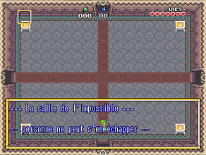

## Enigme 11 – Codez-le une fois

**objectifs pédagogiques**
sensibiliser à la dimension reproductible : pouvoir « rejouer » le code facilement
Expliciter la notion d’éléments variables
Apprendre à écrire soi-même une fonction pour factoriser son code 
 
**cadre narratif**
Dans une maison-arbre, icaRius croise un étrange personnage : l'automate TeoC. Ce dernier lui demande s'il connaît la "Voie du Reproductible". Mauvaise réponse d'icaRius, qui n'a aucune idée du sujet… L'automate déraille, et par la même occasion, envoie icaRius au point de départ : la toute première scène du réveil dans la chambre !!! Les personnages d'origine (le mage Zilap, le mage Regor) sont tous remplacés par des répliques de TeoC. Et ce dernier demande de chercher la copie du grimoire IGoR, à partir de laquelle va se lancer le tutoriel 1(1) (réplique du tutoriel 1). Quand il aura réussi l'épreuve, icaRius sera heureusement renvoyé dans le présent. En récompense, il gagnera un objet qui revient sans cesse au point de départ (métaphore du reproductible) : le boomerang ! Ce dernier lui permet d'atteindre des cibles éloignées, et par la même occasion de débloquer un passage dans le jeu pour aller plus loin.

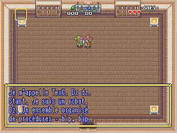

*(l’aventure continue…)*
IcaRius débloque l’entrée d’un nouveau dongeon. A l’issue du dongeon, il combat « l’oeil de SaSSoS » qu’il parvient à vaincre. Obtention de la Rune n°5.

## Enigme 12 – De l’oxygène documentaire

**objectifs pédagogiques**
-sensibiliser à l’importance de la documentation d’un programme, quel qu’il soit
- découvrir une grammaire pour documenter ses fonctions
- découvrir les principes (très simplifiés) sur la construction d’un package

**cadre narratif**
IcaRius arrive au bord du grand lac de Statia… aussi appelé le DataLake. Mais il ne sait pas nager, et ne peut le traverser pour rejoindre l’île qui se situe en plein milieu. Un drôle d’oiseau, FebeleR, féru de littérature statisienne et de grimoires, lui propose de lui apprendre un nouveau sortilège, le sortilège palme()… mais encore faut-il en connaître le mode de fonctionnement. Et donc savoir documenter un sortilège. 

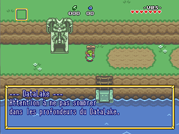

*(l’aventure continue…)*
IcaRius arrive sur une île, avec le dernier dongeon : le palais de la glace. A l’issue du dongeon, il combat « le brouillard du code embrouillé » qu’il parvient à vaincre. Obtention de la Rune n°6

## Enigme 13 – Ce qui se conçoit bien s’écrit clairement

**objectifs pédagogiques**
- faire la transition depuis le monde d'apprentissage du Funcamp vers le monde "réel" d'apprentissage de R à la fin de la journée. 
- donner un premier aperçu de l'IDE Rstudio, a
- découvrir Rmarkdown comme solution centrale pour marier un traitement statistique et le produit attendu (un rapport, une note de synthèse, un graphique commenté…). 

**cadre narratif**
A la toute fin de l'aventure, icaRius doit écrire lui même le dernier chapitre de l'histoire. C'est dans cette ultime page qu'il doit raconter comment il a vaincu SaSSoS. Vertu performative de la langue runique : le fait de l'écrire conduit à réaliser ce qu'elle mentionne, et le monde de statis est sauvé ! 

*(l’aventure continue… et se termine !)*
IcaRius écrit comment il parvient à vaincre les terribles proc de SaSSoS. Aussitôt cette page écrite, le joueur se dirige vers l'antre de SaSSOs, qu'il combat pour libérer Statia… **et mystère quand à la dernière scène du jeu, il vous faudra jouer pour la découvrir :-)**